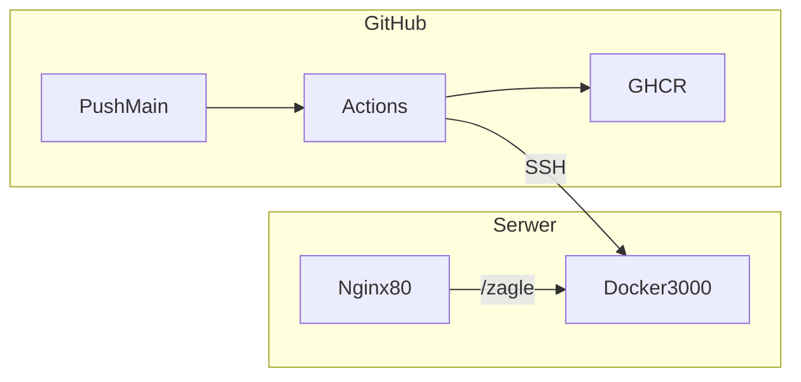

# Deploy aplikacji na własny serwer (Docker + GitHub Actions)

Ten dokument prowadzi **krok po kroku** przez pierwsze wdrożenie. Zakładamy: aplikacja ma być pod adresem **`http://194.163.189.157/zagle`**, kontener na serwerze, automatyczny deploy po wypchnięciu kodu na GitHub.

---

## Jak to działa (w jednym zdaniu)

Po **wypchnięciu zmian na gałąź `main`** GitHub Actions: buduje obraz Dockera, wysyła go do **GHCR** (rejestr obrazów GitHub), łączy się po **SSH** z Twoim serwerem, w katalogu deploy zapisuje plik `.env` z adresem obrazu i uruchamia `docker compose pull` oraz `docker compose up -d`. **Nginx** na porcie 80 przekierowuje ruch z `/zagle` do kontenera na `127.0.0.1:3000`.



---

## Zanim zaczniesz — checklista

- [ ] Konto **GitHub** i repozytorium z tym kodem.
- [ ] Domyślna gałąź do deployu to **`main`** (workflow uruchamia się tylko przy pushu na `main`).
- [ ] **Serwer** z zainstalowanym **Dockerem** i poleceniem **`docker compose`** (plugin lub v2).
- [ ] **Nginx** (lub inny reverse proxy) nasłuchujący na porcie **80** — żeby wejść w przeglądarce pod `http://IP/...` bez `:3000`.
- [ ] Dostęp **SSH** do serwera jako użytkownik **`admin`** (lub zmienisz instrukcję pod swój login).
- [ ] Ścieżka deploy na serwerze: **`/home/admin/zagle`** (tak jest ustawione w tej instrukcji).

Aplikacja jest skonfigurowana pod podścieżkę **`/zagle`** w `next.config.ts` (`basePath`). To nie jest ten sam adres co IP — IP wpisujesz w Nginx i w przeglądarce; ścieżka `/zagle` musi się zgadzać z konfiguracją aplikacji.

---

## Część A — Repozytorium i workflow

1. Kod musi być na GitHubie (repozytorium **remote** `origin` zwykle wskazuje na github.com).
2. W repozytorium powinien być plik **`.github/workflows/deploy.yml`**. Po pierwszym pushu na `main` w zakładce repo pojawi się **Actions** — tam zobaczysz historię uruchomień.
3. **Nie musisz** sam dodawać sekretu `GITHUB_TOKEN`. GitHub **automatycznie** wstrzykuje go do każdego workflow; w pliku workflow jest ustawione uprawnienie `packages: write`, żeby Actions mógł **wypchnąć obraz** do GHCR.

---

## Część B — Klucz SSH (na swoim komputerze)

GitHub Actions musi móc **zalogować się na serwer tak jak Ty po SSH**. Używasz **pary kluczy**: prywatny zostaje tylko u Ciebie i w Secret na GitHubie; publiczny wklejasz **tylko na serwer**.

### B1. Wygeneruj parę kluczy (PowerShell na Windows)

```powershell
ssh-keygen -t ed25519 -C "github-actions-zagle" -f "$env:USERPROFILE\.ssh\zagle_actions"
```

- Przy pytaniu o **hasło (passphrase)** możesz nacisnąć **Enter dwa razy** — wtedy klucz nie ma hasła. To jest typowe pod automatyczny deploy; **chroń plik prywatny** — kto go ma, może się logować jako Ty (jeśli ma też publiczny na serwerze).

Powstaną dwa pliki:

| Plik | Co to jest |
|------|------------|
| `zagle_actions` | **Klucz prywatny** — tylko do Secret `SSH_PRIVATE_KEY` na GitHubie, nikomu nie wysyłaj, nie wklejaj na czat. |
| `zagle_actions.pub` | **Klucz publiczny** — jedna linia zaczynająca się od `ssh-ed25519`; trafia na serwer. |

### B2. Publiczny klucz na serwerze

Zaloguj się na serwer (tymczasowo hasłem lub innym kluczem) jako **`admin`** i wykonaj np.:

```bash
mkdir -p ~/.ssh
chmod 700 ~/.ssh
nano ~/.ssh/authorized_keys
```

Wklej **całą jedną linię** z pliku `zagle_actions.pub`, zapisz plik, potem:

```bash
chmod 600 ~/.ssh/authorized_keys
```

**Dlaczego:** serwer akceptuje logowanie kluczem tylko wtedy, gdy linia publicznego klucza jest w `authorized_keys`.

### B3. Test z Twojego PC

```powershell
ssh -i "$env:USERPROFILE\.ssh\zagle_actions" admin@TWÓJ_IP_LUB_HOSTNAME
```

Jeśli wchodzisz bez hasła (lub tylko z passphrase, jeśli je ustawiłeś) — GitHub też będzie mógł użyć **tego samego klucza prywatnego** w Secret.

---

## Część C — Serwer: jednorazowe przygotowanie

Wykonujesz na serwerze (np. przez SSH jako `admin`).

### C1. Katalog deploy

```bash
mkdir -p /home/admin/zagle
```

Tu będzie **`docker-compose.yml`** i plik **`.env`** (`.env` utworzy / nadpisze GitHub Actions przy deployu).

### C2. Plik `docker-compose.yml`

Skopiuj z repozytorium plik [`docker-compose.yml`](docker-compose.yml) do **`/home/admin/zagle/`** (np. `nano`, `scp` z PC, albo sklonuj repo i skopiuj jeden plik). W tym katalogu **musi** być ten plik — workflow robi `docker compose` właśnie tutaj.

Zawartość compose definiuje usługę `zagle`, port **tylko na localhost**: `127.0.0.1:3000:3000`, żeby z sieci nie było go widać bez Nginx.

### C3. Uprawnienia do Dockera

Użytkownik `admin` musi móc uruchamiać `docker` i `docker compose`. Jeśli dostajesz *permission denied*, dodaj użytkownika do grupy `docker` (jednorazowo, często wymaga wylogowania / nowej sesji):

```bash
sudo usermod -aG docker admin
```

**Dlaczego:** Actions łączy się jako `admin` i odpala `docker compose pull` — bez grupy `docker` polecenie się nie wykona.

### C4. Dostęp do obrazu na GHCR (`docker compose pull`)

Po pierwszym udanym buildzie na GitHubie powstanie **pakiet** (Package) z obrazem na GHCR. Jeśli pakiet jest **prywatny**, serwer przy `docker compose pull` musi być **zalogowany** do `ghcr.io`:

```bash
docker login ghcr.io -u TWOJA_NAZWA_UŻYTKOWNIKA_GITHUB
```

Hasło to zwykle **PAT** (Personal Access Token) z uprawnieniem `read:packages`.

**Alternatywa:** w ustawieniach pakietu na GitHubie ustaw **publiczny** obraz — wtedy `pull` bez logowania często działa od razu (zależnie od polityki organizacji).

---

## Część D — Konfiguracja w GitHub (przeglądarka)

Wejdź w repozytorium: **Settings** → **Secrets and variables** → **Actions**.

### Secrets (tajne)

**New repository secret** — dodaj trzy sekrety:

| Nazwa | Wartość |
|--------|---------|
| `SSH_HOST` | Adres serwera, np. `194.163.189.157` lub domena. |
| `SSH_USER` | `admin` (jeśli używasz innego użytkownika SSH — wpisz jego login). |
| `SSH_PRIVATE_KEY` | **Cała** zawartość pliku prywatnego `zagle_actions` (bez `.pub`), od `-----BEGIN` do `-----END` włącznie. |

**Secret vs Variable:** sekrety są maskowane w logach Actions. **Variables** (zmienne) nie są traktowane jako hasła — nadają się np. na ścieżkę katalogu, która i tak jest widoczna na serwerze.

### Variables (zmienne)

Zakładka **Variables** → **New repository variable**:

| Nazwa | Wartość |
|--------|---------|
| `DEPLOY_PATH` | `/home/admin/zagle` |

**Dlaczego:** workflow wykonuje `cd` do tego katalogu i tam uruchamia `docker compose`. Musi być **identycznie** jak folder z `docker-compose.yml` na serwerze.

---

## Część E — Nginx (port 80 → aplikacja na 3000)

Przeglądarka łączy się z serwerem na porcie **80**. Kontener nasłuchuje na **127.0.0.1:3000** tylko lokalnie. **Nginx** „przekłada” adres `http://194.163.189.157/zagle/...` na to samo żądanie do aplikacji na `127.0.0.1:3000`, żeby ścieżka `/zagle` była widoczna dla Next.js (zgodnie z `basePath`).

Dodaj w konfiguracji serwera (np. w `server { ... }` dla tego hosta / domyślnego) blok:

```nginx
location /zagle {
    proxy_pass http://127.0.0.1:3000;
    proxy_http_version 1.1;
    proxy_set_header Host $host;
    proxy_set_header X-Real-IP $remote_addr;
    proxy_set_header X-Forwarded-For $proxy_add_x_forwarded_for;
    proxy_set_header X-Forwarded-Proto $scheme;
}
```

Potem sprawdź składnię i przeładuj Nginx (komendy mogą się różnić w zależności od dystrybucji):

```bash
sudo nginx -t
sudo systemctl reload nginx
```

---

## Część F — Pierwszy deploy i sprawdzenie

1. **Wypchnij kod na `main`** (commit + `git push origin main`).
2. W repo otwórz **Actions** → wybierz workflow **Build and deploy** → ostatnie uruchomienie.
3. Powinny być zielone kroki m.in. **Build and push** (obraz na GHCR) oraz **Deploy over SSH** (pull i start na serwerze).

**Na serwerze** (opcjonalna kontrola):

```bash
docker ps
curl -I http://127.0.0.1:3000/zagle
```

**W przeglądarce:** `http://194.163.189.157/zagle`

---

## Co jeśli coś nie działa?

| Objaw | Co sprawdzić |
|--------|----------------|
| Workflow w ogóle nie startuje | Czy push poszedł na gałąź **`main`**, a nie tylko na inną gałąź? |
| Błąd przy **Deploy over SSH** | `SSH_HOST`, `SSH_USER`, `SSH_PRIVATE_KEY`; czy ten sam publiczny klucz jest w `authorized_keys` dla tego użytkownika; test `ssh -i ...` z PC. |
| Błąd przy **docker compose pull** | Czy obraz jest publiczny albo czy na serwerze był `docker login ghcr.io` z PAT z `read:packages`. |
| **502** / brak strony pod adresem z IP | Czy kontener działa (`docker ps`), czy Nginx ma blok `location /zagle` i czy `reload` się udał (`nginx -t`). |
| Strona częściowo bez stylów | Zwykle zła ścieżka / proxy — upewnij się, że aplikacja ma `basePath` zgodny z `/zagle` i że wchodzisz pod **`/zagle`**, a nie pod root `/`. |

---

## Skrót nazw

- **GHCR** — GitHub Container Registry: miejsce, gdzie Actions zapisuje zbudowany obraz Dockera (`ghcr.io/...`).
- **GitHub Actions** — automatyczne zadania uruchamiane na serwerach GitHub po `push` itd.

Jeśli zmienisz użytkownika albo ścieżkę na serwerze, zaktualizuj **`DEPLOY_PATH`**, użytkownika w **Części C** oraz sekret **`SSH_USER`** tak, żeby wszędzie było spójnie.
