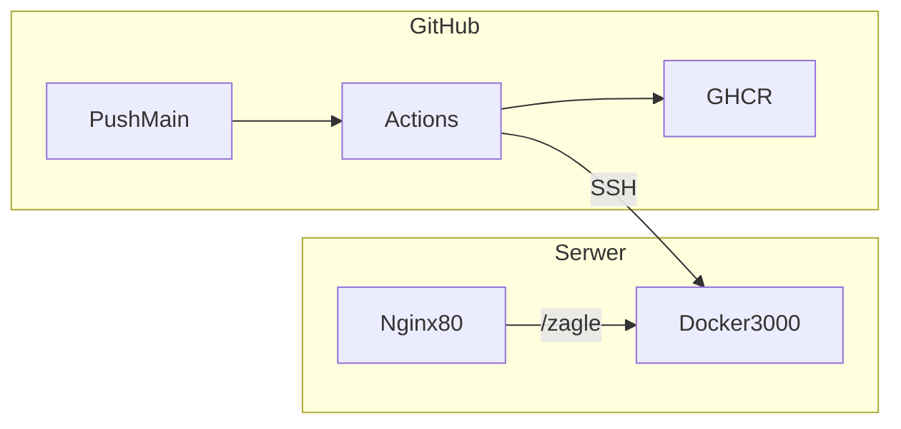

# Deploy aplikacji na własny serwer (Docker + GitHub Actions)

Ten dokument prowadzi **krok po kroku** przez pierwsze wdrożenie. Zakładamy: aplikacja ma być pod adresem **`http://194.163.189.157/zagle`**, kontener na serwerze, automatyczny deploy po wypchnięciu kodu na GitHub.

Aktualny, skrocony stan dzialajacej konfiguracji po wdrozeniu jest opisany w: `docs/USTAWIENIA_DEPLOY.md`.

---

## Jak to działa (w jednym zdaniu)

Po **wypchnięciu zmian na gałąź `main`** GitHub Actions: buduje obraz Dockera, wysyła go do **GHCR** (rejestr obrazów GitHub), łączy się po **SSH** z Twoim serwerem, w katalogu deploy zapisuje plik `.env` z adresem obrazu i uruchamia `docker compose pull` oraz `docker compose up -d`. **Nginx** na porcie 80 przekierowuje ruch z `/zagle` do kontenera na `127.0.0.1:3000`.



---

## Zanim zaczniesz — checklista

- [ ] Konto **GitHub** i repozytorium z tym kodem.
- [ ] Domyślna gałąź do deployu to **`main`** (workflow uruchamia się tylko przy pushu na `main`).
- [ ] **Serwer** z zainstalowanym **Dockerem** i poleceniem **`docker compose`** (plugin lub v2).
- [ ] **Nginx** (lub inny reverse proxy) nasłuchujący na porcie **80** — żeby wejść w przeglądarce pod `http://IP/...` bez `:3000`.
- [ ] Dostęp **SSH** do serwera jako użytkownik **`admin`** (lub zmienisz instrukcję pod swój login).
- [ ] Ścieżka deploy na serwerze: **`/home/admin/zagle`** (tak jest ustawione w tej instrukcji).

Aplikacja jest skonfigurowana pod podścieżkę **`/zagle`** w `next.config.ts` (`basePath`). To nie jest ten sam adres co IP — IP wpisujesz w Nginx i w przeglądarce; ścieżka `/zagle` musi się zgadzać z konfiguracją aplikacji.

---

## Część A — Repozytorium i workflow

1. Kod musi być na GitHubie (repozytorium **remote** `origin` zwykle wskazuje na github.com).
2. W repozytorium powinien być plik **`.github/workflows/deploy.yml`**. Po pierwszym pushu na `main` w zakładce repo pojawi się **Actions** — tam zobaczysz historię uruchomień.
3. **Nie musisz** sam dodawać sekretu `GITHUB_TOKEN`. GitHub **automatycznie** wstrzykuje go do każdego workflow; w pliku workflow jest ustawione uprawnienie `packages: write`, żeby Actions mógł **wypchnąć obraz** do GHCR.

---

## Część B — Klucz SSH (na swoim komputerze)

GitHub Actions musi móc **zalogować się na serwer tak jak Ty po SSH**. Używasz **pary kluczy**: prywatny zostaje tylko u Ciebie i w Secret na GitHubie; publiczny wklejasz **tylko na serwer**.

### B1. Wygeneruj parę kluczy (PowerShell na Windows)

```powershell
ssh-keygen -t ed25519 -C "github-actions-zagle" -f "$env:USERPROFILE\.ssh\zagle_actions"
```

- Przy pytaniu o **hasło (passphrase)** możesz nacisnąć **Enter dwa razy** — wtedy klucz nie ma hasła. To jest typowe pod automatyczny deploy; **chroń plik prywatny** — kto go ma, może się logować jako Ty (jeśli ma też publiczny na serwerze).

Powstaną dwa pliki:

| Plik | Co to jest |
|------|------------|
| `zagle_actions` | **Klucz prywatny** — tylko do Secret `SSH_PRIVATE_KEY` na GitHubie, nikomu nie wysyłaj, nie wklejaj na czat. |
| `zagle_actions.pub` | **Klucz publiczny** — jedna linia zaczynająca się od `ssh-ed25519`; trafia na serwer. |

### B2. Publiczny klucz na serwerze

Zaloguj się na serwer (tymczasowo hasłem lub innym kluczem) jako **`admin`** i wykonaj np.:

```bash
mkdir -p ~/.ssh
chmod 700 ~/.ssh
nano ~/.ssh/authorized_keys
```

Wklej **całą jedną linię** z pliku `zagle_actions.pub`, zapisz plik, potem:

```bash
chmod 600 ~/.ssh/authorized_keys
```

**Dlaczego:** serwer akceptuje logowanie kluczem tylko wtedy, gdy linia publicznego klucza jest w `authorized_keys`.

### B3. Test z Twojego PC

```powershell
ssh -i "$env:USERPROFILE\.ssh\zagle_actions" admin@TWÓJ_IP_LUB_HOSTNAME
```

Jeśli wchodzisz bez hasła (lub tylko z passphrase, jeśli je ustawiłeś) — GitHub też będzie mógł użyć **tego samego klucza prywatnego** w Secret.

---

## Część C — Serwer: jednorazowe przygotowanie

Wykonujesz na serwerze (np. przez SSH jako `admin`).

### C1. Katalog deploy

```bash
mkdir -p /home/admin/zagle
```

Tu będzie **`docker-compose.yml`** i plik **`.env`** (`.env` utworzy / nadpisze GitHub Actions przy deployu).

### C2. Plik `docker-compose.yml`

Skopiuj z repozytorium plik [`docker-compose.yml`](docker-compose.yml) do **`/home/admin/zagle/`** (np. `nano`, `scp` z PC, albo sklonuj repo i skopiuj jeden plik). W tym katalogu **musi** być ten plik — workflow robi `docker compose` właśnie tutaj.

Zawartość compose definiuje usługę `zagle`, port **tylko na localhost**: `127.0.0.1:3000:3000`, żeby z sieci nie było go widać bez Nginx.

### C3. Uprawnienia do Dockera

Użytkownik `admin` musi móc uruchamiać `docker` i `docker compose`. Jeśli dostajesz *permission denied*, dodaj użytkownika do grupy `docker` (jednorazowo, często wymaga wylogowania / nowej sesji):

```bash
sudo usermod -aG docker admin
```

**Dlaczego:** Actions łączy się jako `admin` i odpala `docker compose pull` — bez grupy `docker` polecenie się nie wykona.

### C4. Dostęp do obrazu na GHCR (`docker compose pull`)

Po pierwszym udanym buildzie na GitHubie powstanie **pakiet** (Package) z obrazem na GHCR. Jeśli pakiet jest **prywatny**, serwer przy `docker compose pull` musi być **zalogowany** do `ghcr.io`:

```bash
docker login ghcr.io -u TWOJA_NAZWA_UŻYTKOWNIKA_GITHUB
```

Hasło to zwykle **PAT** (Personal Access Token) z uprawnieniem `read:packages`.

**Alternatywa:** w ustawieniach pakietu na GitHubie ustaw **publiczny** obraz — wtedy `pull` bez logowania często działa od razu (zależnie od polityki organizacji).

---

## Część D — Konfiguracja w GitHub (przeglądarka)

Wejdź w repozytorium: **Settings** → **Secrets and variables** → **Actions**.

### Secrets (tajne)

**New repository secret** — dodaj trzy sekrety:

| Nazwa | Wartość |
|--------|---------|
| `SSH_HOST` | Adres serwera, np. `194.163.189.157` lub domena. |
| `SSH_USER` | `admin` (jeśli używasz innego użytkownika SSH — wpisz jego login). |
| `SSH_PRIVATE_KEY` | **Cała** zawartość pliku prywatnego `zagle_actions` (bez `.pub`), od `-----BEGIN` do `-----END` włącznie. |

**Secret vs Variable:** sekrety są maskowane w logach Actions. **Variables** (zmienne) nie są traktowane jako hasła — nadają się np. na ścieżkę katalogu, która i tak jest widoczna na serwerze.

### Variables (zmienne)

Zakładka **Variables** → **New repository variable**:

| Nazwa | Wartość |
|--------|---------|
| `DEPLOY_PATH` | `/home/admin/zagle` |

**Dlaczego:** workflow wykonuje `cd` do tego katalogu i tam uruchamia `docker compose`. Musi być **identycznie** jak folder z `docker-compose.yml` na serwerze.

---

## Część E — Reverse proxy (Nginx) — port 80 → aplikacja na 3000

### Co już wiesz z `ss`

Jeśli widzisz m.in. **`0.0.0.0:80`** — **ktoś już nasłuchuje na porcie 80** (to dobry znak: zwykle to główny reverse proxy). **Nie uruchamiaj drugiego** serwisu, który też chce zająć `:80` — jeden adres IP = jeden proces na porcie 80.

Widoczne też **`8000`** i **`8080`** to zwykle **inne aplikacje** (np. mapowania z Dockera). **Nie ruszaj ich** pod kątem Zagle — ta instrukcja dodaje tylko obsługę ścieżki **`/zagle`** na tym samym wejściu co reszta ruchu na 80.

Żeby zobaczyć **który program** trzyma 80 (bez `sudo` często brak nazwy procesu):

```bash
sudo ss -tlnp | grep ':80'
```

- Jeśli to **nginx na hoście** — dopisujesz `location /zagle` do **istniejącego** pliku / bloku `server { ... }`, który obsługuje Twój IP lub `default_server`.
- Jeśli w kolumnie `users` widać **`docker-proxy`** przy `:80` — port 80 obsługuje **kontener** (mapowanie `80:80` lub podobne). Poniżej: osobna instrukcja.

### Gdy `ss` pokazuje `docker-proxy` na porcie 80 (typowy VPS z Nginx w Dockerze)

Oznacza to: **nie** edytujesz (być może w ogóle nieistniejącego) Nginx systemowego na hoście, tylko **Nginx w tym kontenerze**, który ma wystawiony host `:80`.

1. **Znajdź kontener** (szukaj mapowania na `80`):

   ```bash
   docker ps --format "table {{.Names}}\t{{.Image}}\t{{.Ports}}"
   ```

   Interesuje Cię linia z czymś w stylu **`0.0.0.0:80->80/tcp`** (lub `:::80->80/tcp`).

2. **Gdzie jest konfiguracja** — często katalog zamontowany z hosta:

   ```bash
   docker inspect NAZWA_KONTENERA --format '{{json .Mounts}}' | jq
   ```

   (bez `jq` możesz `docker inspect NAZWA_KONTENERA` i przejrzeć `Mounts` ręcznie.) Szukaj ścieżki do plików z `nginx.conf` / `conf.d`.

3. **Backend Zagle** działa na **hoście** pod `127.0.0.1:3000` (tak jest w `docker-compose` tego projektu). Z **wnętrza innego kontenera** adres `127.0.0.1` to **ten kontener**, nie host — dlatego w `proxy_pass` użyj adresu hosta widzianego z Dockera, np.:

   - **`http://172.17.0.1:3000`** — często działa na Linuksie (brama sieci `docker0` → host). Sprawdź z kontenera frontowego:

     ```bash
     docker exec NAZWA_FRONTOWEGO_NGINX sh -c 'wget -qO- --timeout=3 http://172.17.0.1:3000/zagle 2>/dev/null | head -c 200 || echo FAIL'
     ```

     (albo `curl`, jeśli jest w obrazie.)

   - Jeśli **nie działa**, w compose frontowego stacka można dodać `extra_hosts: - "host.docker.internal:host-gateway"` (Docker obsługuje `host-gateway`) i wtedy **`http://host.docker.internal:3000`** w `proxy_pass`.

4. **Blok do wklejenia** w `server { ... }` **w konfiguracji frontowego Nginx (w kontenerze)** — użyj adresu z punktu 3 zamiast `127.0.0.1`. Prefiks **`^~`** zatrzymuje dalsze szukanie **regexowych** `location` — jeśli bez niego całe `/zagle` wpada do innej apki (np. `/login`), zwykle brakuje tego bloku albo wygrywa inna reguła.

   ```nginx
   location ^~ /zagle {
       proxy_pass http://172.17.0.1:3000;
       proxy_http_version 1.1;
       proxy_set_header Host $host;
       proxy_set_header X-Real-IP $remote_addr;
       proxy_set_header X-Forwarded-For $proxy_add_x_forwarded_for;
       proxy_set_header X-Forwarded-Proto $scheme;
   }
   ```

   **`proxy_pass`** ma być **bez** dopisku ścieżki po porcie (`...:3000;`), żeby Nginx przekazywał pełne URI `/zagle/...` do Next.js.

5. **Przeładuj Nginx w kontenerze** (nie `systemctl` na hoście, jeśli Nginx tylko w Dockerze):

   ```bash
   docker exec NAZWA_FRONTOWEGO_NGINX nginx -t
   docker exec NAZWA_FRONTOWEGO_NGINX nginx -s reload
   ```

`sudo nginx -T` na hoście **pokaże konfigurację tylko hostowego** Nginx — jeśli front jest wyłącznie w kontenerze, edycja musi być **w plikach tego kontenera / jego volume**.

### Przykład z Twojego serwera (`docker ps`)

U Ciebie port **80** ma kontener **`nadprodukcje-nginx-1`** (obraz `nadprodukcje-nginx`) — to **ten** Nginx dopisujesz o `/zagle`. Pozostałe wpisy (**`filebrowser`** na **8080**, **Portainer** na **8000** / **9443**, **`bot_cenowy-*`**, backend `nadprodukcje`) zostawiasz; nie zmieniasz ich portów ani konfiguracji, chyba że świadomie łączysz routing w jednym pliku `nadprodukcje`.

**Konkretne komendy** (podstawiasz własną ścieżkę do pliku po `inspect`):

```bash
docker inspect nadprodukcje-nginx-1 --format '{{json .Mounts}}'
docker exec nadprodukcje-nginx-1 nginx -t
docker exec nadprodukcje-nginx-1 nginx -s reload
```

Test z kontenera frontowego do Nexta na hoście:

```bash
docker exec nadprodukcje-nginx-1 sh -c 'wget -qO- --timeout=3 http://172.17.0.1:3000/zagle 2>/dev/null | head -c 200 || echo FAIL'
```

### `curl` na `127.0.0.1:3000/zagle` daje 200, ale w przeglądarce `http://IP/zagle` wchodzisz na `/login` innej aplikacji

To **normalny** objaw przy stacku **nadprodukcje**: port **80** obsługuje Nginx w **`nadprodukcje-nginx-1`**, który domyślnie kieruje ruch (np. `location /`) do **backendu nadprodukcje** — stąd logowanie. **Next (Zagle) na `:3000` działa**, ale **nie jest podpięty pod publiczny `/zagle`**, dopóki w konfiguracji **tego** frontowego Nginx nie dodasz bloku **`location ^~ /zagle`** z `proxy_pass` do **`http://172.17.0.1:3000`** (jak wyżej), w tym samym `server { ... }`, który ma `listen 80` dla Twojego IP / domeny.

Po `nginx -s reload` sprawdź z serwera (przez front na 80):

```bash
curl -I http://127.0.0.1/zagle
```

**Dobry** wynik (proxy do Next): m.in. **`X-Powered-By: Next.js`**, **`Vary:`** z prefiksem Next, większy HTML (np. dziesiąki KB). **Zły** wynik: **`Accept-Ranges: bytes`**, **`Last-Modified`**, **`ETag`**, mały **`Content-Length`** (setki bajtów) — to Nginx serwuje **plik statyczny** z dysku (`root` / `alias`), a **nie** `proxy_pass` do `:3000`.

### `curl -I http://127.0.0.1/zagle` daje 200, ale to statyczny plik (~409 B), nie Next.js

Masz w konfiguracji **inny** blok dla `/zagle` (albo katalog `zagle` pod `root`), który **wygrywa** albo **nie ma** aktywnego `proxy_pass` do `172.17.0.1:3000`.

1. Zobacz **efektywną** konfigurację w kontenerze frontowym:

   ```bash
   docker exec nadprodukcje-nginx-1 nginx -T 2>/dev/null | grep -n "zagle"
   ```

   Szukaj **`location`** z `zagle` — czy jest **`proxy_pass http://172.17.0.1:3000`**, czy **`root`/`alias`/`try_files`**.

2. **Usuń lub zakomentuj** statyczny `location` dla `/zagle` i zostaw **jeden** blok:

   ```nginx
   location ^~ /zagle {
       proxy_pass http://172.17.0.1:3000;
       proxy_http_version 1.1;
       proxy_set_header Host $host;
       proxy_set_header X-Real-IP $remote_addr;
       proxy_set_header X-Forwarded-For $proxy_add_x_forwarded_for;
       proxy_set_header X-Forwarded-Proto $scheme;
   }
   ```

3. Upewnij się, że edytujesz **`server { ... }`**, który naprawdę obsługuje ruch (czasem jest kilka plików `include`). Test z nagłówkiem **Host** jak z zewnątrz:

   ```bash
   curl -I -H "Host: 194.163.189.157" http://127.0.0.1/zagle
   ```

   (Podstaw swój IP / domenę, jeśli inna.)

4. `docker exec nadprodukcje-nginx-1 nginx -t && docker exec nadprodukcje-nginx-1 nginx -s reload`

Konfigurację edytuj w pliku **na hoście**, który jest zamontowany do tego kontenera (ścieżka z `Mounts`), albo tymczasowo `docker exec -it nadprodukcje-nginx-1 sh` — ale po restarcie kontenera zmiany **wewnątrz obrazu bez volume** znikną, więc trwale: **volume / katalog projektu `nadprodukcje`**.

### Czy starsze aplikacje przestaną działać?

**Nie** przez sam fakt dodania **`location ^~ /zagle`** z proxy: żądania pod `/zagle` idą do Nexta; **pozostałe ścieżki** dalej jak wcześniej. Nie usuwaj innych reguł **poza** ewentualnym **konfliktującym** starym `location` dla `/zagle` (statyczny plik), który trzeba usunąć albo zastąpić proxy.

### Blok do wklejenia (gdy frontowy Nginx jest na hoście, Next na `127.0.0.1:3000`)

Wewnątrz właściwego `server { ... }`:

```nginx
location ^~ /zagle {
    proxy_pass http://127.0.0.1:3000;
    proxy_http_version 1.1;
    proxy_set_header Host $host;
    proxy_set_header X-Real-IP $remote_addr;
    proxy_set_header X-Forwarded-For $proxy_add_x_forwarded_for;
    proxy_set_header X-Forwarded-Proto $scheme;
}
```

**Gdy `proxy_pass` idzie z kontenera na hosta** z Next na `127.0.0.1:3000`, zamień `http://127.0.0.1:3000` na adres hosta widziany z kontenera (np. `http://172.17.0.1:3000`) i sprawdź `curl` z wnętrza kontenera.

Podgląd aktywnej konfiguracji Nginx na hoście (szukaj `listen 80`):

```bash
sudo nginx -T 2>/dev/null | less
```

Potem sprawdź składnię i przeładuj (dystrybucje mogą się różnić):

```bash
sudo nginx -t
sudo systemctl reload nginx
```

---

## Część F — Pierwszy deploy i sprawdzenie

1. **Wypchnij kod na `main`** (commit + `git push origin main`).
2. W repo otwórz **Actions** → workflow **Build and deploy** → ostatnie uruchomienie. Są **dwa joby**: **`build`** (obraz na GHCR) i **`deploy`** (SSH na serwer). Jeśli **`build`** jest zielony, a **`deploy`** czerwony — aplikacja **nie** trafi na VPS; wejdź w job **`deploy`** i przeczytaj log kroku **Deploy over SSH** (są jawne komunikaty przy braku `DEPLOY_PATH` lub `docker-compose.yml`).
3. Oba joby powinny być zielone; w logu deploy widać wypisaną linię `ZAGLE_IMAGE=...` i `docker compose ps`.

**Na serwerze** (opcjonalna kontrola):

```bash
docker ps
curl -I http://127.0.0.1:3000/zagle
```

**W przeglądarce:** `http://194.163.189.157/zagle`

---

## Zgodność ścieżek (co musi się zgadzać)

| Miejsce | Wartość / plik | Uwagi |
|--------|----------------|--------|
| GitHub → Variable **`DEPLOY_PATH`** | `/home/admin/zagle` (u Ciebie) | **Identyczna** ścieżka jak na serwerze; workflow robi `cd` i `docker compose` tam. |
| Na serwerze: katalog | **`$DEPLOY_PATH`** istnieje, należy do użytkownika z Dockerem | Tworzysz ręcznie: `mkdir -p /home/admin/zagle`. |
| Na serwerze: **`docker-compose.yml`** | Wewnątrz `$DEPLOY_PATH` | Ten sam plik co w repozytorium ([`docker-compose.yml`](docker-compose.yml)): serwis **`zagle`**, `image: ${ZAGLE_IMAGE}`, port **`127.0.0.1:3000:3000`**. |
| Na serwerze: **`.env`** | `$DEPLOY_PATH/.env` | Tworzy **GitHub Actions** przy deployu: jedna linia `ZAGLE_IMAGE=ghcr.io/.../zagle:<sha>`. |
| Kontener | zwykle **`zagle-zagle-1`** | Nazwa z folderu projektu compose + nazwa serwisu. |
| Aplikacja (kod) | URL pod **`/zagle`** | [`next.config.ts`](next.config.ts): `basePath: "/zagle"`. |
| Front Nginx | **`nadprodukcje-nginx-1`** | Osobny stack; w jego configu **`location ^~ /zagle`** → **`http://172.17.0.1:3000`** (host z perspektywy kontenera). |

Jeśli **`DEPLOY_PATH`** na GitHubie to np. `/home/admin/zagle`, a pliki leżą w `/opt/zagle` — deploy zapisze `.env` w złym miejscu lub w ogóle padnie na `cd`.

### Skrypt kontrolny (wklej na serwerze po SSH)

Na początku ustaw **`DEPLOY_PATH`** tak jak w GitHub Variables.

```bash
DEPLOY_PATH=/home/admin/zagle

echo "=== 1. Katalog deploy ==="
ls -la "$DEPLOY_PATH" 2>&1 || echo "BŁĄD: brak katalogu $DEPLOY_PATH"

echo "=== 2. Wymagane pliki ==="
for f in docker-compose.yml .env; do
  test -f "$DEPLOY_PATH/$f" && echo "OK  $f" || echo "BRAK $f"
done

echo "=== 3. ZAGLE_IMAGE z .env ==="
test -f "$DEPLOY_PATH/.env" && grep ZAGLE "$DEPLOY_PATH/.env" || true

echo "=== 4. docker compose ps (z $DEPLOY_PATH) ==="
(cd "$DEPLOY_PATH" && docker compose ps) 2>&1

echo "=== 5. Nasłuch 127.0.0.1:3000 ==="
ss -tlnp 2>/dev/null | grep 3000 || true

echo "=== 6. Next bezpośrednio (powinno być X-Powered-By: Next.js) ==="
curl -sI "http://127.0.0.1:3000/zagle" | head -10

echo "=== 7. Przez Nginx :80 /zagle ==="
curl -sI "http://127.0.0.1/zagle" | head -12

echo "=== 8. Linie z \"zagle\" w nginx -T (front) ==="
docker exec nadprodukcje-nginx-1 nginx -T 2>/dev/null | grep -n "zagle" || echo "(brak — dopisz location ^~ /zagle z proxy_pass)"
```

**Interpretacja:** punkt **6** OK, **7** bez Next.js → problem tylko w konfiguracji **`nadprodukcje-nginx-1`**, nie w ścieżkach deployu Zagle.

---

## Co jeśli coś nie działa?

| Objaw | Co sprawdzić |
|--------|----------------|
| Workflow w ogóle nie startuje | Czy push poszedł na gałąź **`main`**, a nie tylko na inną gałąź? |
| **build** OK, **deploy** pada / błąd SSH | Job **deploy** → log. Brak **`DEPLOY_PATH`** w Variables? Brak **`docker-compose.yml`** w tym katalogu na serwerze? Sekrety **`SSH_*`**, klucz w `authorized_keys`, test z PC: `ssh -i ... user@host`. Workflow robi **`ssh-keyscan`** przed SSH; dalej błąd → firewall / port 22. |
| Błąd przy **docker compose pull** | Czy obraz jest publiczny albo czy na serwerze był `docker login ghcr.io` z PAT z `read:packages`. |
| **502** / brak strony pod adresem z IP | Czy kontener Next działa (`docker ps`), `curl` na `127.0.0.1:3000/zagle` z hosta; czy **frontowy** Nginx ma `location ^~ /zagle` i reload. Jeśli Nginx jest **w kontenerze**, czy `proxy_pass` sięga hosta (np. `172.17.0.1:3000`), a nie `127.0.0.1` wewnątrz kontenera. |
| **`curl :3000/zagle` → 200, ale w przeglądarce `/zagle` → `/login` innej apki | Front nie ma albo nie wygrywa **`location ^~ /zagle`** z **`proxy_pass`** do `172.17.0.1:3000` w właściwym `server`. |
| **`curl -I http://127.0.0.1/zagle` → 200, mały rozmiar, `Accept-Ranges`, brak `X-Powered-By: Next.js`** | Nginx serwuje **statyczny plik** (inny `location` / `root`). `nginx -T \| grep zagle`, usuń konflikt, zostaw tylko proxy do `:3000`, reload. Test z `-H "Host: TWÓJ_IP"`. |
| Strona częściowo bez stylów | Zwykle zła ścieżka / proxy — upewnij się, że aplikacja ma `basePath` zgodny z `/zagle` i że wchodzisz pod **`/zagle`**, a nie pod root `/`. |

---

## Skrót nazw

- **GHCR** — GitHub Container Registry: miejsce, gdzie Actions zapisuje zbudowany obraz Dockera (`ghcr.io/...`).
- **GitHub Actions** — automatyczne zadania uruchamiane na serwerach GitHub po `push` itd.

Jeśli zmienisz użytkownika albo ścieżkę na serwerze, zaktualizuj **`DEPLOY_PATH`**, użytkownika w **Części C** oraz sekret **`SSH_USER`** tak, żeby wszędzie było spójnie.
